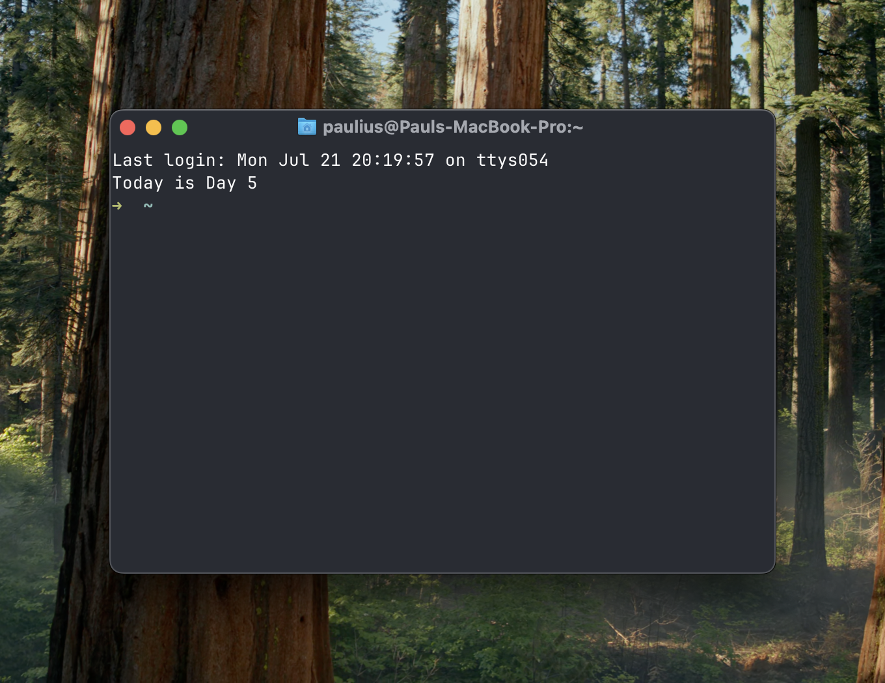

# Company CLI

A simple command-line tool for tracking company days and journaling. Perfect for startup founders who want to track their journey from day zero.



## Features

- **Day Counter**: Shows what "day" your company is on (zero-indexed from your start date)
- **Journaling**: Quick journal entries via command line or vim editor
- **Email Integration**: Send journal entries to your team via email

## Setup

1. **Clone and install dependencies**:
   ```bash
   git clone <your-repo-url>
   cd company-cli
   uv sync
   ```

2. **Configure your company**:
   ```bash
   cp config.sample.yaml config.yaml
   # Edit config.yaml with your company details
   ```

3. **Set up email credentials**:
   ```bash
   cp .env.sample .env
   # Add your Gmail app password to .env
   ```

4. **Generate Gmail App Password**:
   - Enable 2FA on your Gmail account
   - Go to https://myaccount.google.com/apppasswords
   - Generate an app password and add it to your `.env` file

5. **Create aliases** (optional but recommended):
   ```bash
   # Add to your ~/.zshrc or ~/.bashrc
   alias day="/path/to/company-cli/company-cli day"
   alias journal="/path/to/company-cli/company-cli journal"
   alias send-journal="/path/to/company-cli/company-cli send-journal"
   
   # Show company day when opening new terminal (optional)
   /path/to/company-cli/company-cli day
   ```

## Usage

### Check what day it is
```bash
uv run python main.py day
# or with alias: day
```

### Write journal entries
```bash
# Quick entry from command line
uv run python main.py journal "Had a great team meeting today"

# Open vim editor for longer entries
uv run python main.py journal
# or with alias: journal
```

### Send journal entries via email
```bash
# Send today's journal entry
uv run python main.py send-journal

# Send specific date's entry
uv run python main.py send-journal --date 2025-07-20
```

## Configuration

### config.yaml
```yaml
company:
  name: "My Company"
  start_date: "2024-01-01"  # Your company start date (Day 0)
  email_list: "team@mycompany.com"

journal:
  entries_dir: "journal_entries"

email:
  from_address: "your-email@gmail.com"
  smtp_server: "smtp.gmail.com"
  smtp_port: 587
```

### .env
```bash
GMAIL_APP_PASSWORD=your-16-character-app-password
```

## Journal Format

When using the vim editor mode, new entries automatically get a title:
```
Day 5 - Monday, July 22, 2025

Your journal content here...
```

Command-line entries are timestamped:
```
[14:30:15] Had a great team meeting today
```

## Email Format

Journal entries are sent with the subject format:
```
Day 5 Journal - Monday, July 22, 2025
```

## Development

Built with:
- Python 3.12+
- [Typer](https://typer.tiangolo.com/) for CLI
- [uv](https://docs.astral.sh/uv/) for dependency management

## License

MIT